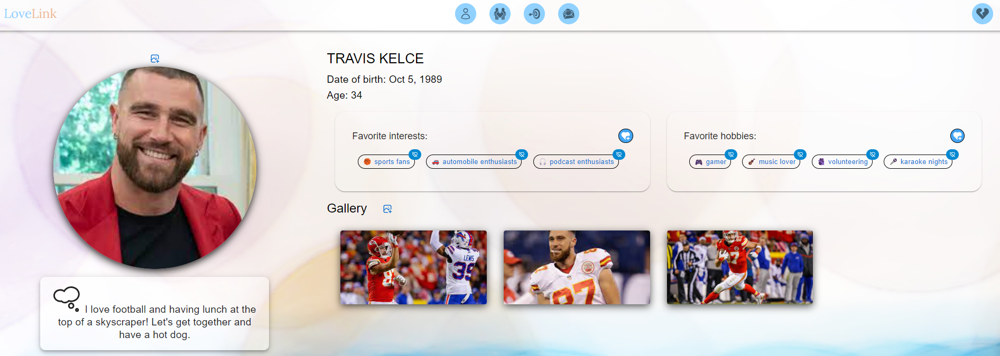
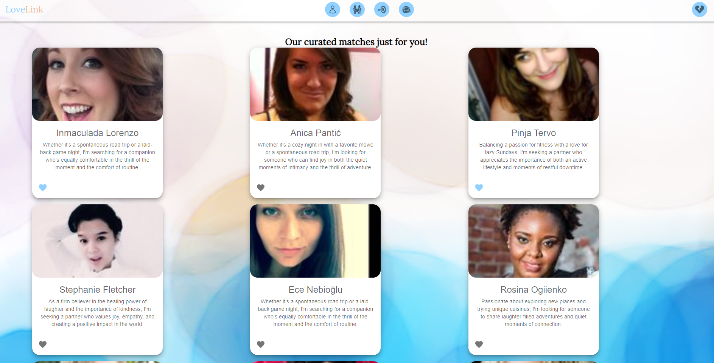
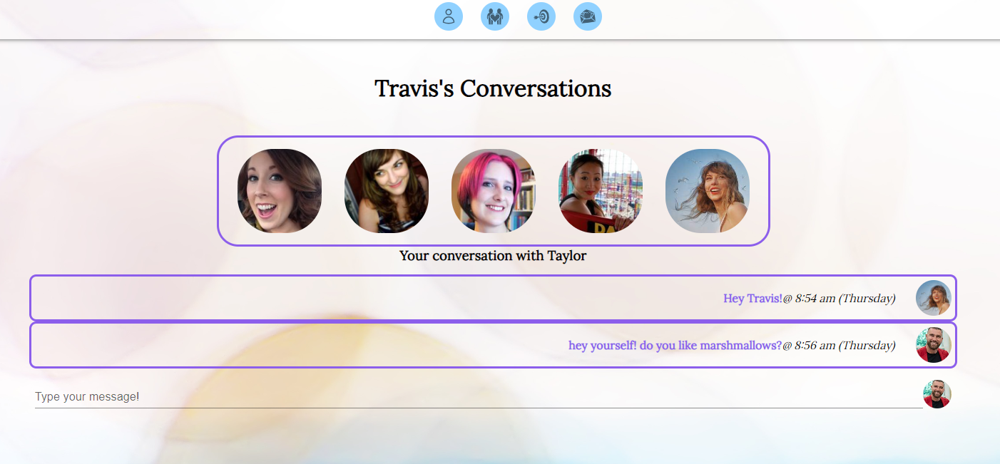
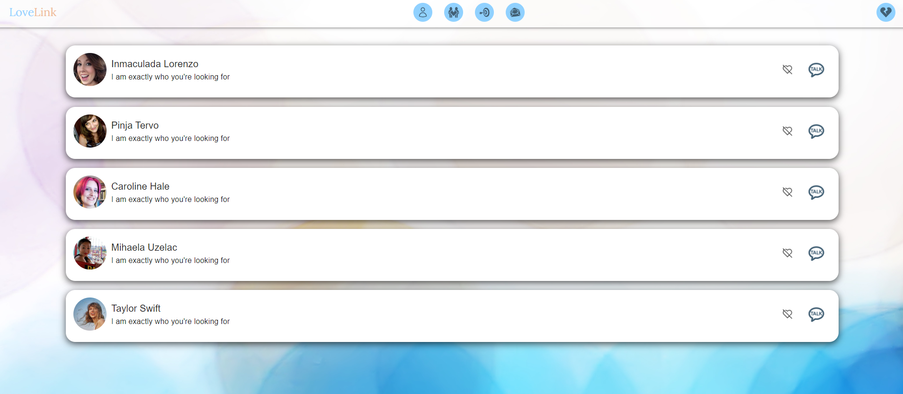

[![Contributors][contributors-shield]][contributors-url]
![Commits][commits-shield]
[![Forks][forks-shield]][forks-url]
[![Stargazers][stars-shield]][stars-url]
[![Issues][issues-shield]][issues-url]
[![MIT License][license-shield]][license-url]

<h3 align="center">Ciao Bootcamp</h3>

Welcome to LoveLink, the premier dating platform designed to bring people together based on shared interests and hobbies. Logging in is quick and easy, allowing users to seamlessly navigate through a world of potential matches tailored to their preferences. Discover like-minded individuals and kickstart meaningful conversations through our user-friendly messaging system. At LoveLink, we prioritize creating a positive and welcoming environment. While enjoying the excitement of finding someone special, users can rest assured that our platform values respect and genuine connections. Join LoveLink today and embark on a journey where connections are sparked, and love blossoms effortlessly.

  

 – LoveLink: Connecting Hearts Through Shared Passions and Personalized Matches

<h3 font size="1" align="right"><a href="https://hidden-garden-06286-72f8e54246d1.herokuapp.com/login" target="_blank">Visit Site🚀</a></h3>

## Table of Contents

<!-- TABLE OF CONTENTS -->

  
Table of Contents

  <ol>
    <li><a href="#tech-stack">Tech Stack</a></li>
    <li><a href="#sneak-peek">Sneak Peek</a></li>
    <li><a href="#how-to-use">How to use</a></li>
    <li><a href="#team">Team</a></li>
  </ol>

## Tech Stack

(<a href="#readme-top">back to top</a>)

## Sneak Peek

 
  

(<a href="#readme-top">back to top</a>)

## How to use

Let's get started!

To begin, either click the blue heart at the top of the screen (if you've been here before and created an account) or fill out the information on the right side. You can specify your gender, what you're looking for, and enter your name, email, and a password.

The next few screens will guide you gently through our profile creation process. You will enter your date of birth, then select any and all from a list of hobbies and interests that align with who you are! You have the option to add and remove hobbies and interests later, too so don't worry if you change your mind. Finally, you will have a chance to write a short blurb that will tell other users about you. Be creative but don't sweat it! Just be yourself.

After finishing your set-up process, you will be directed to your profile page. All of your information that you have entered so far will show up here. This is also the page that other users will see when they find you!

Start by uploading a profile image on the left side of your screen. After selecting the image from your device or another source, hit the refresh button that appears and voila! Everyone can now see your beautiful smiling face. You also have the option to add other images into a gallery that will appear on the right side of the screen. Select one or multiple images and upload them the same way you did for your profile picture.

Click on the matches icon (2nd icon in at the top navigation bar) to see profiles of 

## Team - Ciao Bootcamp

### Oksana 

Email - 

Github - <a href="https://github.com/oprokopieva382">oprokopieva382</a>

### Jorlyna 

Email - 

Github - <a href="https://github.com/jorlyna326">jorlyna326</a>

### Kurt 

Email - <a href="mailto:kurt.riecken@gmail.com">kurt.riecken@gmail.com</a>

Github - <a href="https://github.com/kurtriecken">kurtriecken</a>

(<a href="#readme-top">back to top</a>)

<!-- MARKDOWN LINKS & IMAGES -->
<!-- https://www.markdownguide.org/basic-syntax/#reference-style-links -->

[contributors-shield]: https://img.shields.io/github/contributors/ThatZiro/Listy-Flix.svg?style=for-the-badge
[contributors-url]: https://github.com/kurtriecken/love-link/graphs/contributors
[forks-shield]: https://img.shields.io/github/forks/ThatZiro/Listy-Flix.svg?style=for-the-badge
[forks-url]: https://github.com/kurtriecken/love-link/network/members
[stars-shield]: https://img.shields.io/github/stars/ThatZiro/Listy-Flix.svg?style=for-the-badge
[stars-url]: https://github.com/kurtriecken/love-link/stargazers
[issues-shield]: https://img.shields.io/github/issues/ThatZiro/Listy-Flix.svg?style=for-the-badge
[issues-url]: https://github.com/kurtriecken/love-link/issues
[license-shield]: https://img.shields.io/github/license/ThatZiro/Listy-Flix.svg?style=for-the-badge
[license-url]: https://github.com/kurtriecken/love-link/blob/main/LICENSE
[commits-shield]: https://img.shields.io/github/commit-activity/t/kurtriecken/love-link.svg?style=for-the-badge